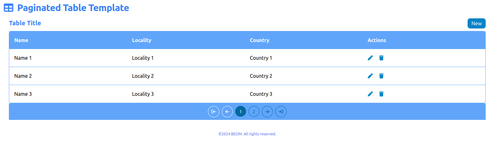

# Paginated Table Template

Paginated Table Template is a web application, built with Vue.js 3 framework.
Allows to demonstrate how to have a paginated table linked to an API.

For test propose it's used the [Formula One API hosted at Ergast API](https://documenter.getpostman.com/view/11586746/SztEa7bL#intro).



## Version

1.0.0

## Resources

- [VueJs](https://vuejs.org/guide/introduction.html)
- [Pinia](https://pinia.vuejs.org/introduction.html)
- [Tailwind CSS](https://v2.tailwindcss.com/docs)
- [Font Awesome free icons](https://fontawesome.com/search?o=r&m=free)

## Getting Started

These instructions will guide you to copy the project from the repository and run it.

### Recommended IDE Setup

[VSCode](https://code.visualstudio.com/) + [Volar](https://marketplace.visualstudio.com/items?itemName=Vue.volar) (and disable Vetur).

### Project Requirements

For the project run you need to have installed:

- VueJs 3
- Pinia
- Tailwind CSS
- Font Awesome free icons

### Local Installation

Basically clone the project from the remote repository to the local machine, using the git commands.

```sh
npm install
```

### Compile and Hot-Reload for Development

```sh
npm run dev
```

### Type-Check, Compile and Minify for Production

```sh
npm run build
```

### Lint with [ESLint](https://eslint.org/)

```sh
npm run lint
```

## Authors

- **BEOM &copy; 2024**
